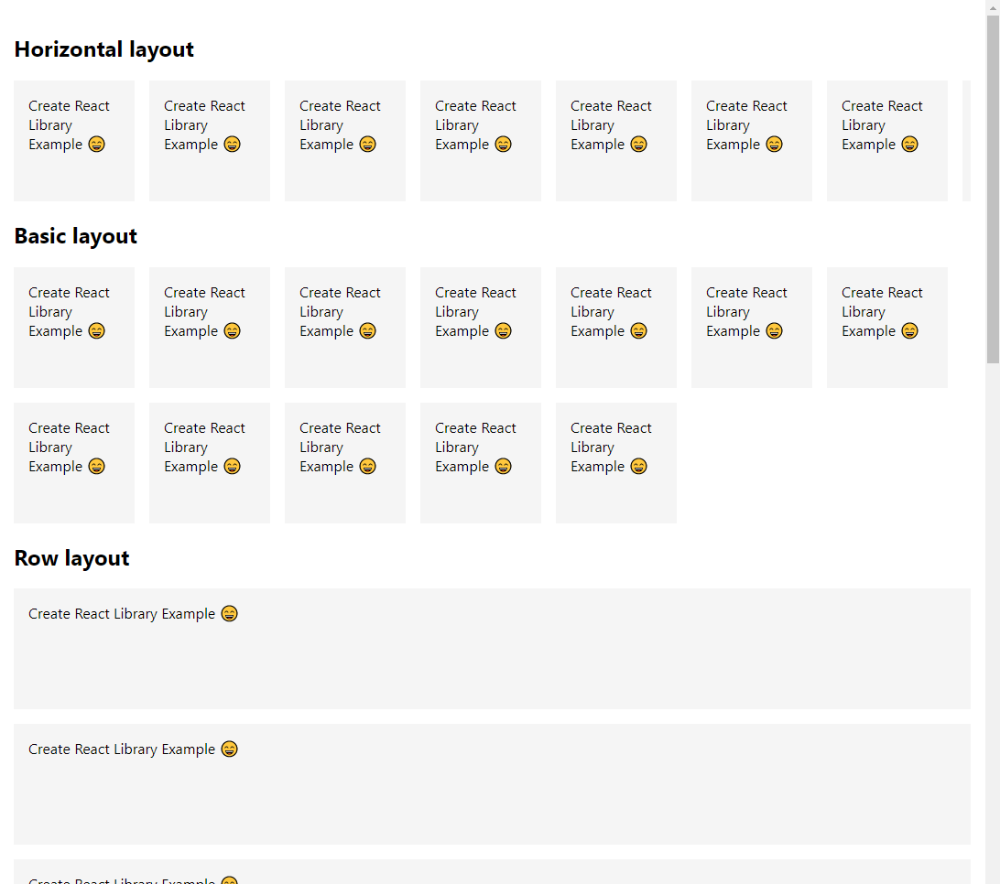

# react-hscroll

> React Horizontal Scrollview

[](https://www.npmjs.com/package/react-hscroll) [](https://standardjs.com)

## Install

```bash
yarn add react-hscroll

or

npm install --save react-hscroll
```

## Usage




```jsx
import React from 'react'
import { List } from 'react-hscroll'

const Item = () => {
  return <div style={{ padding: '1rem',height: 100, width: 100, background: 'whitesmoke' }}>Create React Library Example 😄</div>
}

const sample = []
for (let i = 1; i <= 12; i++) {
  sample.push(i)
}

const App = () => {
  return (
    <div style={{ padding: '1rem' }}>
      <h2>Horizontal layout</h2>
      <List items={sample} component={Item} gap={1}/>

      <h2>Basic layout</h2>
      <List items={sample} component={Item} gap={1} flow='auto' />
      
      <h2>Row layout</h2>
      <List items={sample} component={Item} gap={1} flow='row' />
    </div>
  )
}

export default App

```

## Properties

- gap: number
- items: array
- flow: enum ('horizontal', 'auto', 'row')


## License

MIT © [arbo77](https://github.com/arbo77)
